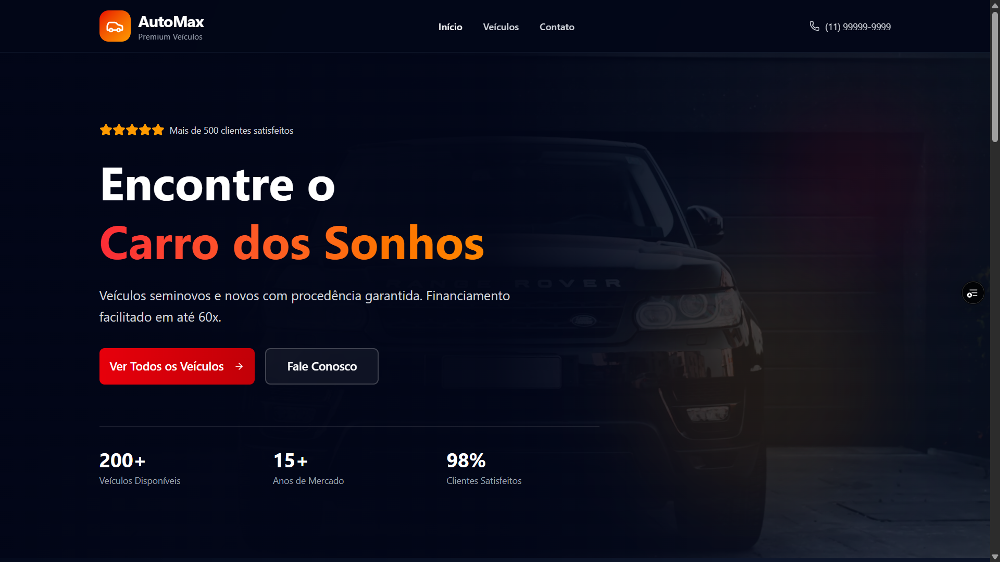
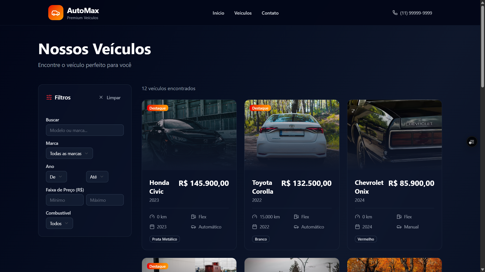
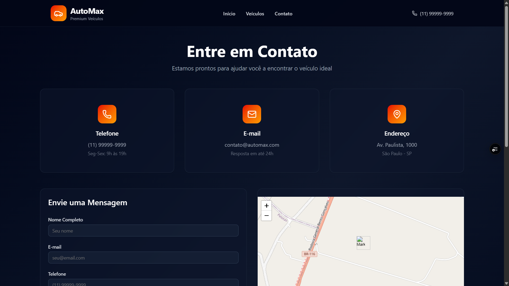

# 🚘 AutoMax

Um site moderno e responsivo para a concessionária **AutoMax**, oferecendo uma experiência elegante e interativa para clientes interessados em veículos.

---

## 🖼️ Screenshots


<!-- ### Página Inicial



### Listagem de Veículos



### Página de Contato

 -->

---

## 📌 Funcionalidades

* **Carros em Destaque**: página inicial com veículos selecionados e animações modernas.
* **Listagem de Veículos**: todos os carros disponíveis, com **filtros dinâmicos** por **marca, preço e ano**.
* **Página de Contato**: formulário funcional para envio de mensagens e integração com **mapa interativo**.
* **Design Responsivo**: otimizado para desktop, tablets e dispositivos móveis.
* **Animações Suaves**: transições e interações criadas com **Framer Motion**.

---

## 🛠️ Tecnologias Utilizadas

* ⚛️ [ReactJS](https://react.dev/) – Biblioteca principal para construção da interface.
* 🟦 [TypeScript](https://www.typescriptlang.org/) – Tipagem estática para maior segurança no desenvolvimento.
* 🎨 [TailwindCSS](https://tailwindcss.com/) – Estilização rápida e responsiva.
* 🧩 [shadcn/ui](https://ui.shadcn.com/) – Componentes acessíveis e personalizáveis.
* 🌐 [React Router](https://reactrouter.com/) – Navegação entre páginas.
* 🎬 [Framer Motion](https://www.framer.com/motion/) – Animações fluidas e interativas.

---

## 🚀 Como Rodar o Projeto

### 1. Clone o repositório

```bash
git clone https://github.com/Grazziano/AutoMax.git
cd automax
```

### 2. Instale as dependências

```bash
npm install
# ou
yarn install
```

### 3. Rode o projeto em modo desenvolvimento

```bash
npm run dev
# ou
yarn dev
```

### 4. Acesse no navegador

```
http://localhost:5173
```

---

## 📂 Estrutura do Projeto

```bash
automax/
├── src/
│   ├── assets/          # Imagens e ícones
│   ├── components/      # Componentes reutilizáveis (botões, cards, header, footer, etc.)
│   ├── data/            # Dados ficticios para alimentar o site
│   ├── layouts          # Layouts da aplicação
│   ├── pages/           # Páginas principais (Home, Listagem, Contato)
│   ├── styles/          # Estilos globais
│   ├── App.tsx          # Componente principal
│   ├── main.tsx         # Ponto de entrada
│   └── routes.tsx       # Configuração de rotas com React Router
├── public/              # Arquivos estáticos
├── package.json
└── README.md
```

---

## 🎯 Próximos Passos

* 🔍 Adicionar busca avançada de veículos.
* 🛒 Criar simulação de financiamento online.
* 📱 Implementar PWA para acesso offline.

---

## 📬 Contato

Desenvolvido por **[Grazziano]** 💻
📧 Email: [grazzianofagundes@gmail.com](mailto:grazzianofagundes@gmail.com)
🌐 Portfolio: [portfolio-grazzianos-projects.vercel.app/](https://portfolio-grazzianos-projects.vercel.app/)
